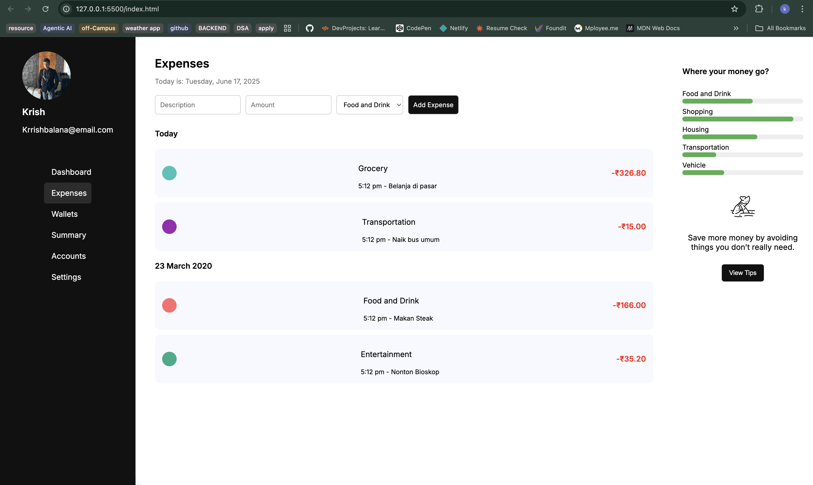

# 💰 Personal Expense Tracker Web App

A responsive and intuitive web application for tracking daily expenses. Built using **HTML, CSS, and JavaScript**, this app lets users manage their finances by adding, deleting, and viewing transactions — all stored in **LocalStorage**, so data persists across sessions.

---

## 🚀 Features

- 📋 Add, View, and Delete transactions (CRUD)
- 📅 Automatically logs the current date
- 🧮 Calculates total balance, income, and expenses
- 💾 Uses **LocalStorage** to persist data
- 📱 Fully responsive UI for mobile and desktop
- ✨ Clean and modern design

---

## 📸 Screenshot



---

## 🛠️ Tech Stack

- **HTML5**
- **CSS3**
- **JavaScript (Vanilla)**
- **LocalStorage API**

---

## 📂 Folder Structure
Expense_tracker/
│
├── index.html
├── style.css
├── script.js
├── README.md
└── preview.png (screenshot file)


---

## 📦 How to Use

1. **Clone the Repository**

```bash
git clone https://github.com/Krrishbalana/expense-tracker.git

